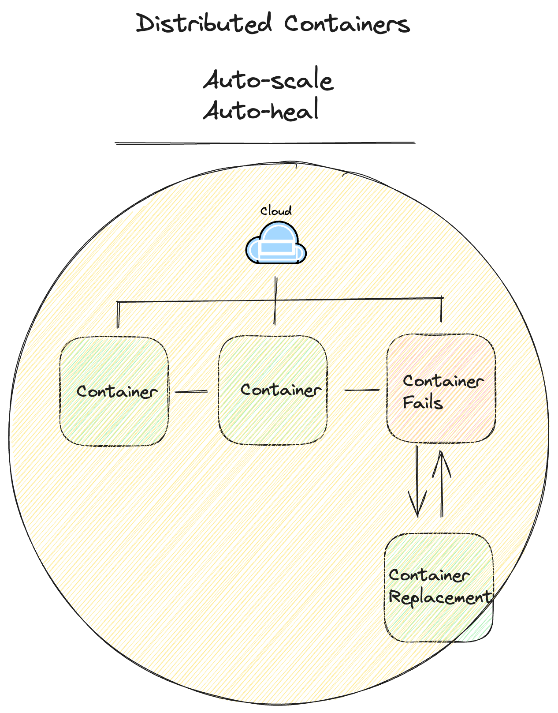
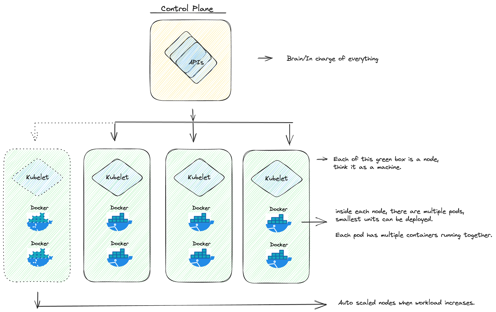

Simply put:
> Kubernetes is essential today, it has become the de facto standard for container orchestration and is widely adopted in the industry. It simplifies the management of containerized applications, making them more reliable, scalable, and easier to maintain in modern cloud-native environments.

### Distributed Containers
Think K8s as a brain, it handles the change of a workload of infrastructure, it scales container across multiple machines, if one fails, it replaces new one.
{ width=80% }

### Control Plane && Kubelet && Nodes
The brain of the operation is known as the Control Plane, it exposes APIs to manage cluster. Each cluster has multiple nodes, inside each node there is something called kubelet, which is a tiny app runs on machine to communicate with the Control Plane. There are also pods in each node. Each node then again has multiple conainers. As workload increases, K8s auto-add new node.


### Config
All the config is written in `.yaml`.
```
kind: Deployment
apiVersion: extensions/v1beta1
metadata:
  name: nginx-deployment
spec:
  # A deployment's specification really only 
  # has a few useful options
  
  # 1. How many copies of each pod do we want?
  replicas: 3

  # 2. How do want to update the pods?
  strategy: Recreate

  # 3. Which pods are managed by this deployment?
  selector:
    # This must match the labels we set on the pod!
    matchLabels:
      deploy: example
  
  # This template field is a regular pod configuration 
  # nested inside the deployment spec
  template:
    metadata:
      # Set labels on the pod.
      # This is used in the deployment selector.
      labels:
        deploy: example
    spec:
      containers:
        - name: nginx
          image: nginx:1.7.9
```
